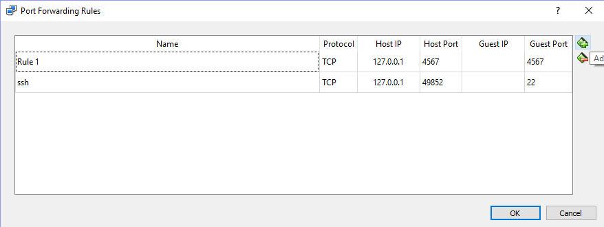

This is the project repo for the final project of the Udacity Self-Driving Car Nanodegree: Programming a Real Self-Driving Car. For more information about the project, see the project introduction [here](https://classroom.udacity.com/nanodegrees/nd013/parts/6047fe34-d93c-4f50-8336-b70ef10cb4b2/modules/e1a23b06-329a-4684-a717-ad476f0d8dff/lessons/462c933d-9f24-42d3-8bdc-a08a5fc866e4/concepts/5ab4b122-83e6-436d-850f-9f4d26627fd9).

Please use **one** of the three installation options.

### 1. Native Installation

* Be sure that your workstation is running Ubuntu 16.04 Xenial Xerus or Ubuntu 14.04 Trusty Tahir. [Ubuntu downloads can be found here](https://www.ubuntu.com/download/desktop).
* If using a Virtual Machine to install Ubuntu, use the following configuration as minimum:
  * 2 CPU
  * 2 GB system memory
  * 25 GB of free hard drive space
* Follow these instructions to install ROS
  * [ROS Kinetic](http://wiki.ros.org/kinetic/Installation/Ubuntu) if you have Ubuntu 16.04.
  * [ROS Indigo](http://wiki.ros.org/indigo/Installation/Ubuntu) if you have Ubuntu 14.04.
* [Dataspeed DBW](https://bitbucket.org/DataspeedInc/dbw_mkz_ros)
  * Use this option to install the SDK on a workstation that already has ROS installed: [One Line SDK Install (binary)](https://bitbucket.org/DataspeedInc/dbw_mkz_ros/src/81e63fcc335d7b64139d7482017d6a97b405e250/ROS_SETUP.md?fileviewer=file-view-default)

### 2. Using Virtual Machine
The Udacity provided virtual machine has ROS and Dataspeed DBW already installed, so you can skip the next two steps if you are using this. The only problem is that it's a rather large download (4+GB!). So, find yourself a good internet connection and download the [compressed VM disk image](https://s3-us-west-1.amazonaws.com/udacity-selfdrivingcar/Udacity_VM_Base_V1.0.0.zip). Note that you need to set up port forwarding once the virtual machine is imported to [VirtualBox](https://www.virtualbox.org/wiki/Downloads).

#### Port Forwarding
* First open up Oracle VM VirtualBox
* Click on the default session and select settings.
* Click on Network, and then Advanced.
* Click on Port Forwarding
* Click on the green plus, adds new port forwarding rule.
* Add a rule that assigns 4567 as both the host port and guest Port, as in the screenshot.



### The rest of steps to run the project if you choose one of the first two options.
1. Clone the project repository
```bash
git clone https://github.com/udacity/CarND-Capstone.git
```
2. Install python dependencies
```bash
cd CarND-Capstone
pip install -r requirements.txt
```
3. Make and run styx
```bash
cd ros
catkin_make
source devel/setup.sh
roslaunch launch/styx.launch
```
4. Download the [Udacity Simulator](https://github.com/udacity/CarND-Capstone/releases) and run the simulator

### 3. Docker Installation
[Install Docker](https://docs.docker.com/engine/installation/)

Build the docker container
```bash
git clone https://github.com/udacity/CarND-Capstone.git
cd CarND-Capstone
docker build . -t capstone
```
Run the docker file
```bash
docker run -p 4567:4567 -v $PWD:/capstone -v /tmp/log:/root/.ros/ --rm -it capstone
```
3. Make and run styx
```bash
catkin_make
source devel/setup.sh
roslaunch launch/styx.launch
```
4. Run the simulator

#### upgrade pillow

If receiving the error below:
```
File "/capstone/ros/src/styx/bridge.py", line 180, in publish_camera
image_message = self.bridge.cv2_to_imgmsg(image_array, encoding="rgb8")
File "/opt/ros/kinetic/lib/python2.7/dist-packages/cv_bridge/core.py", line 248, in cv2_to_imgmsg
img_msg.height = cvim.shape[0]
IndexError: tuple index out of range
```
Can be solved with `pip install pillow --upgrade` inside the docker container.

### Real world testing 
**Can only be used for the first two installation options. It will not work within a Docker image.**
1. Download [training bag](https://s3-us-west-1.amazonaws.com/udacity-selfdrivingcar/traffic_light_bag_file.zip) that was recorded on the Udacity self-driving car.
2. Unzip the file
```bash
unzip traffic_light_bag_file.zip
```
3. Open a terminal and start roscore, for example, you could use the script below.
```bash
roslaunch launch/site.launch
```
4. Open another terminal, play the bag file
```bash
rosbag play -l traffic_light_bag_file/traffic_light_training.bag
```
5. Open one more terminal and run rviz using with [this configure file](https://github.com/wzding/Electric_Eel_Capstone/blob/master/script/default.rviz)
```bash
rosrun rviz rviz -d script/default.rviz
```
6. You'll be able to see visualization like this:


